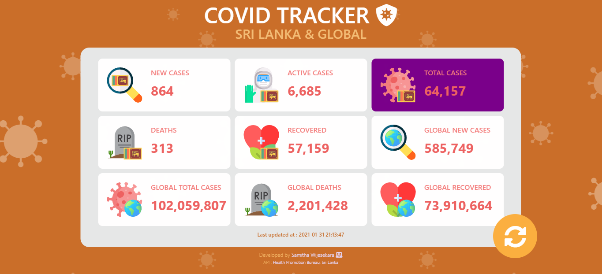

# COVID TRACKER 😷
Track Covid Stats in Sri Lanka &amp; Global

 

💻😍 You can use this link to send me a message : https://covid-tracker-srilanka.netlify.app/

### Table of Content
-01 [What is this?](#What) 
-02 [For why?](#why) 
-03 [What are the technologies used?](#technologies) 
-04 [How to used this?](#How) 

## What is this?<a name="What"/>
This is a COVID stats tracker webapp. 

  

## For why?<a name="why"/>
From using this you can see the latest COVID stats in Sri Lanka and worldwide. 🌠

## What are the technologies used?<a name="technologies"/>
- HTML
- CSS
- JavaScript
- API

I have used an API that was created by Health Promotion Bureau in Sri Lanka for this project.  
[(https://hpb.health.gov.lk/)](https://hpb.health.gov.lk/)

## How to use this?<a name="How"/>

Click **Reload** button & get the latest COVID stats in Sri Lanka and worldwide.  
  

